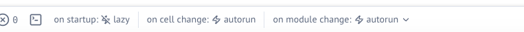

<div align="center">
<picture>
  <source media="(prefers-color-scheme: dark)" srcset="public/DEATHCon2025-logo.png">
  <source media="(prefers-color-scheme: light)" srcset="public/DEATHCon2025-logo-light.png">
  
</picture>
</div>

# Building Custom Memory Analysis Tools with the Modern Python Data Ecosystem

By [Kyrre Wahl Kongsgård](https://www.linkedin.com/in/kyrrewk/) and [Anja Olsen](https://www.linkedin.com/in/anja-olsen-5a2643b9/).

The attack scenario and memory dump used in this workshop were created by [Øyvind Brusethaug](https://www.linkedin.com/in/%C3%B8yvind-brusethaug-2b123339/).

## Overview

This workshop reframes memory forensics as a data analysis problem and shows how the modern Python data ecosystem can be used to build interactive tools, visualizations, and data apps for processing the output of Volatility plugins using DuckDB, marimo notebooks, and the Volatility framework.

We demonstrate how marimo and DuckDB can be combined to create a notebook-based environment where Volatility plugin output is treated as tables that can be queried, transformed, and enriched. We also explore how marimo's reactive execution model and support for custom UI elements enable the creation of powerful analysis tools, such as interactive process tree visualizations.

## What You'll Learn

- Use marimo's reactive notebooks for interactive memory forensics
- Query Volatility outputs with DuckDB and Ibis dataframe APIs
- Build custom dashboards with interactive UI components
- Create visualizations with Altair
- Correlate data across multiple Volatility plugins
- Use marimo's AI features for assisted analysis

Join the workshop's [Discord channel](https://discord.com/channels/1249481364277825557/1427526483156533370) for questions, discussion, companion videos, and access to the memory dump.

## Setup

```bash
# Clone the repository
git clone <repository-url>
cd deathcon-workshop

# Install uv package manager (if not already installed)
# See: https://docs.astral.sh/uv/getting-started/installation/

# Create virtual environment and install dependencies
uv sync

# Launch notebooks
uv run marimo edit .
```

The workshop consists of 6 notebooks (1-6). Start with `1_getting_started_with_marimo.py` and work through them in order.

## Notebook Settings

By default, marimo notebooks execute all cells automatically on startup. For instructional purposes and to ensure consistent behavior across all workshop participants, we have configured `on_cell_change = "autorun"` in the project's `pyproject.toml` under `[tool.marimo.runtime]`. 

You can change this behavior by removing the `on_cell_change = "autorun"` line from `pyproject.toml`. Once removed, you can then control autorun behavior through the "on startup" setting in the notebook interface.

<div align="center">
  
</div>
</br>

We have also enforced light mode (`theme = "light"`) because the custom visualizations and colors in the workshop notebooks were designed specifically for light mode. You can switch to dark mode for other notebooks, but keep in mind that the workshop visualizations may not display correctly without the light theme.

For more configuration options, see the [marimo configuration docs](https://docs.marimo.io/guides/configuration/#user-configuration). Note that project settings in `pyproject.toml` override global settings in `~/.marimo.toml`.

## Running Volatility Plugins

Place the Windows memory dump file (`CLIENT-02.dmp`) in the project root directory.

We run Volatility using `uv run vol` because Volatility 3 is included as a project dependency. This has been tested on macOS and Windows.

First time running Volatility, create a configuration file to save the symbol table information:

```bash
uv run vol -f CLIENT-02.dmp --write-config windows.pslist
```

This generates a `config.json` file. Subsequent runs can use this config file for faster execution:

```bash
mkdir -p volatility_plugin_output
uv run vol --config config.json -r parquet windows.pslist > volatility_plugin_output/windows.pslist.PsList.parquet
```

The `-r parquet` flag outputs results in Parquet format for use with the notebooks. The notebooks will guide you on which plugins to run as you progress through the workshop.
